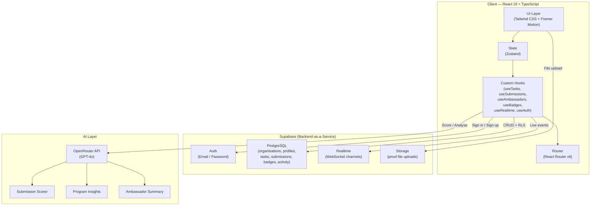
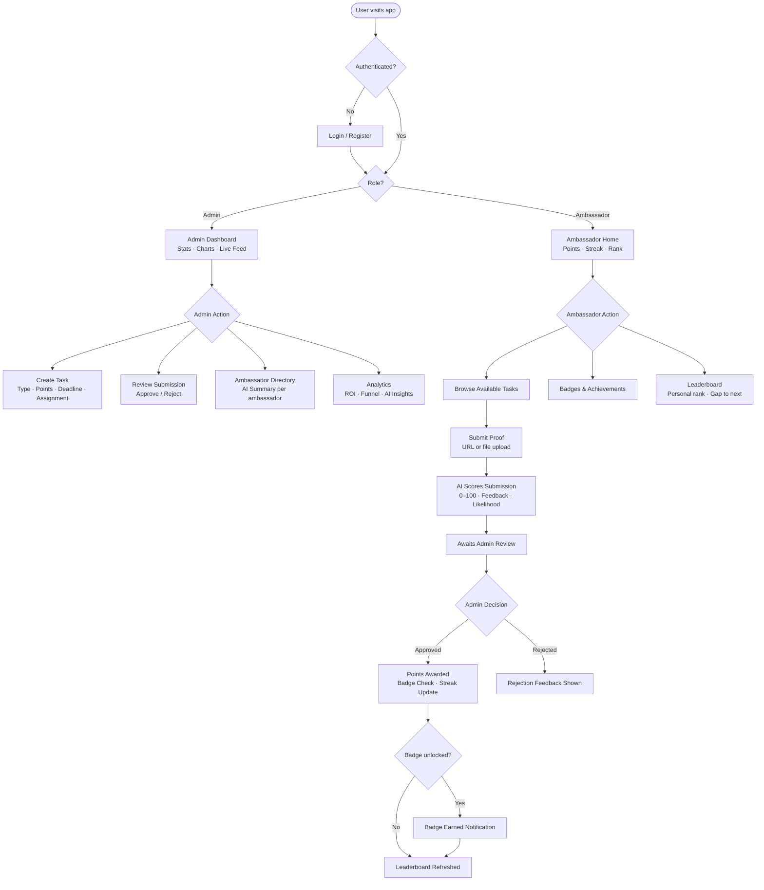
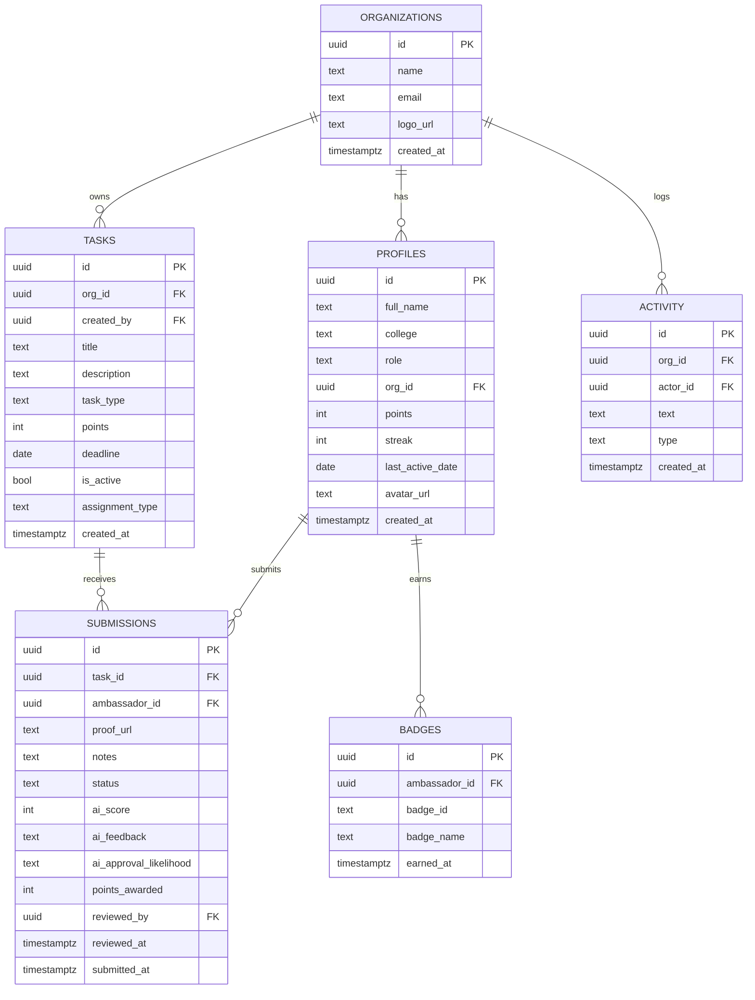
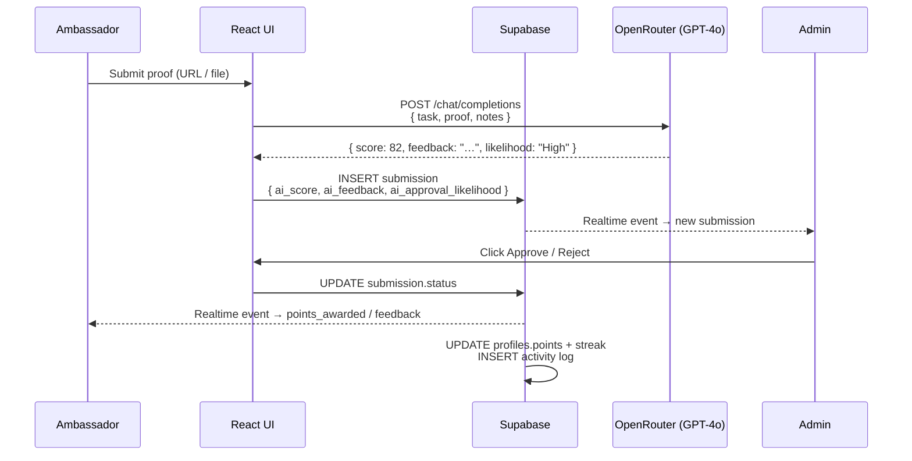

<div align="center">

# CampusConnect

### AI-Powered Campus Ambassador Management Platform

<br/>

## 🌐 [Live Demo → aihackethon.vercel.app](https://aihackethon.vercel.app)

<br/>

[](https://aihackethon.vercel.app)
[](https://react.dev)
[](https://www.typescriptlang.org)
[](https://supabase.com)
[](https://tailwindcss.com)
[](https://vite.dev)

<br/>

> **Turn ambassadors into a growth engine.**
> A full-stack, AI-powered, gamified platform for managing campus ambassador programs — with real-time updates, AI scoring, and rich analytics.

</div>

---

## Table of Contents

- [Overview](#-overview)
- [Demo Video](#-demo-video)
- [Live Demo](#-live-demo)
- [Key Features](#-key-features)
- [System Architecture](#-system-architecture)
- [User Flow Diagram](#-user-flow-diagram)
- [Database Schema (ERD)](#-database-schema-erd)
- [AI Pipeline](#-ai-pipeline)
- [Tech Stack](#-tech-stack)
- [Project Structure](#-project-structure)
- [Quick Start](#-quick-start)
- [Environment Variables](#-environment-variables)
- [Deployment](#-deployment)
- [Screens at a Glance](#-screens-at-a-glance)

---

## 🎯 Overview

CampusConnect solves a real problem: **organizations running campus ambassador programs have no unified way to assign tasks, measure impact, and keep ambassadors engaged.**

This platform provides:
- A **command center for admins** — create tasks, review submissions, see live analytics
- A **gamified workspace for ambassadors** — earn points, badges, streak rewards, and climb leaderboards
- **AI-powered evaluation** — every submission is scored 0–100 by GPT-4o via OpenRouter, with written feedback and an approval likelihood estimate

Everything is backed by **Supabase** (PostgreSQL + Auth + Realtime), so all data is live and persistent across sessions.

---

## 🎬 Demo Video

> Watch the full platform walkthrough on Google Drive:

<div align="center">

### ▶️ [Click here to watch the Demo Video](https://drive.google.com/file/d/1VbbMG1RgfvpWbWY12vFYNexf1QDe079X/view?usp=drivesdk)

[](https://drive.google.com/file/d/1VbbMG1RgfvpWbWY12vFYNexf1QDe079X/view?usp=drivesdk)

</div>

---

## 🌐 Live Demo

| Link | Description |
|------|-------------|
| **[https://aihackethon.vercel.app](https://aihackethon.vercel.app)** | Production deployment |
| **[Demo Video](https://drive.google.com/file/d/1VbbMG1RgfvpWbWY12vFYNexf1QDe079X/view?usp=drivesdk)** | Full walkthrough on Google Drive |

**Try it instantly — no signup needed for demo mode:**

| Role | How to access |
|------|---------------|
| Admin | Register a new account → select **Organization Admin** |
| Ambassador | Register → select **Ambassador**, join an existing org |

---

## ✨ Key Features

### For Organization Admins

| Feature | Description |
|---------|-------------|
| 📊 Command Dashboard | Animated stat cards, 7-day activity chart, points-by-college breakdown, live activity feed, top-performer profiles |
| ✅ Task Management | Create tasks with type, points, deadline, and assignment scope (global or specific ambassadors) |
| 👁️ Submission Review | One-click approve / reject with AI score, feedback, and approval likelihood displayed inline |
| 👥 Ambassador Directory | Searchable, sortable table with AI-generated performance summaries per ambassador |
| 🏆 Leaderboard | Full ranked list with tier badges (Bronze → Silver → Gold → Platinum) and confetti for top 3 |
| 📈 Analytics | ROI score, completion funnel, submission pie chart, engagement trend, college heatmap, GPT-4o program insights |
| ⚙️ Settings | Organisation name, theme (light/dark), account deletion |

### For Campus Ambassadors

| Feature | Description |
|---------|-------------|
| 🏠 Home Dashboard | Animated points counter, rank-tier progress bar, streak calendar, pending task count |
| 📋 My Tasks | Tab view (Available / Pending / Approved / Rejected), proof submission via URL or file upload |
| 🏅 Badges | 10 unique achievement badges with progress hints and earned timestamps |
| 🏆 Leaderboard | Personal rank highlighted, gap-to-next-rank tracker |

### AI Features (OpenRouter / GPT-4o)

| Feature | What it does |
|---------|-------------|
| 🤖 Task Scorer | Scores each submission 0–100, writes feedback, predicts approval likelihood (High / Medium / Low) |
| 💡 Program Insights | Generates 3 strategic recommendations for the admin based on live program data |
| 📝 Ambassador Summaries | Auto-writes a performance summary card for every ambassador in the directory |

---

## 🏗️ System Architecture



---

## 🔄 User Flow Diagram



---

## 🗄️ Database Schema (ERD)



---

## 🤖 AI Pipeline



---

## 🛠️ Tech Stack

| Layer | Technology | Purpose |
|-------|-----------|---------|
| Framework | React 19 + TypeScript 6 | UI and type safety |
| Build | Vite 8 | Sub-second HMR and optimised production builds |
| Styling | Tailwind CSS v3 | Utility-first responsive design |
| Animation | Framer Motion 12 | Page transitions, micro-interactions |
| Charts | Recharts 3 | Activity, points, funnel, and pie charts |
| Routing | React Router v6 | Role-based protected routes |
| State | Zustand 5 | Global store with localStorage persistence |
| Backend | Supabase | Auth, PostgreSQL, Realtime, Storage |
| AI | OpenRouter → GPT-4o | Submission scoring, insights, summaries |
| Icons | Lucide React | Consistent icon set |
| Notifications | React Hot Toast | Non-intrusive toast messages |
| Date utils | date-fns 4 | Streak tracking, chart date ranges |
| Deployment | Vercel | Zero-config CI/CD from git |

---

## 📁 Project Structure

```
src/
├── main.tsx                          # React entry point
├── App.tsx                           # BrowserRouter + protected route tree
├── index.css                         # Tailwind base + global styles
│
├── types/
│   └── index.ts                      # All TypeScript interfaces + tier helpers
│
├── store/
│   └── useAppStore.ts                # Zustand global store
│
├── lib/
│   ├── supabase.ts                   # Supabase client
│   └── openrouter.ts                 # AI scoring, insights, summary helpers
│
├── hooks/
│   ├── useAuth.ts                    # Sign in / sign up / sign out
│   ├── useAmbassadors.ts             # Fetch + cache ambassador profiles
│   ├── useTasks.ts                   # Task CRUD
│   ├── useSubmissions.ts             # Submission CRUD + proof upload
│   ├── useBadges.ts                  # Badge fetch + award logic
│   ├── useActivity.ts                # Activity feed
│   └── useRealtime.ts                # Supabase Realtime subscriptions
│
├── components/
│   ├── layout/
│   │   ├── AdminLayout.tsx           # Sidebar + outlet wrapper for admin
│   │   ├── AmbassadorLayout.tsx      # Bottom nav + outlet for ambassador
│   │   ├── AdminSidebar.tsx          # Collapsible nav with route highlights
│   │   ├── AmbassadorNav.tsx         # Mobile-friendly bottom navigation
│   │   ├── ProtectedRoute.tsx        # Role-based route guard
│   │   └── PageWrapper.tsx           # Consistent page padding/fade-in
│   │
│   ├── ui/
│   │   ├── StatCard.tsx              # Reusable stat card with glow effect
│   │   ├── TaskCard.tsx              # Task display card with deadline badge
│   │   ├── Modal.tsx                 # Accessible modal with backdrop
│   │   ├── ConfirmDialog.tsx         # Danger-action confirmation dialog
│   │   ├── AIScoreReveal.tsx         # Animated AI score reveal component
│   │   ├── BadgeItem.tsx             # Badge display with progress hint
│   │   ├── ActivityFeed.tsx          # Live activity item list
│   │   ├── LeaderboardRow.tsx        # Ranked row with tier + points
│   │   ├── EmptyState.tsx            # Zero-state placeholder
│   │   └── LoadingSpinner.tsx        # Full-page / inline spinner
│   │
│   ├── charts/
│   │   ├── ActivityChart.tsx         # 7-day bar chart (submissions + approvals)
│   │   └── PointsChart.tsx           # Points-by-college bar chart
│   │
│   └── ambassador/
│       └── SubmitProofModal.tsx      # Proof URL / file upload + AI pre-score
│
├── pages/
│   ├── Login.tsx                     # Auth landing with role selection
│   ├── Register.tsx                  # Registration form
│   │
│   ├── admin/
│   │   ├── AdminDashboard.tsx        # Stats, charts, top performers, live feed
│   │   ├── TaskManagement.tsx        # Task list + create modal + review panel
│   │   ├── AmbassadorDirectory.tsx   # Searchable ambassador table + AI summary
│   │   ├── AdminLeaderboard.tsx      # Full ranked list with confetti
│   │   ├── Analytics.tsx             # ROI, funnel, pie chart, AI insights
│   │   └── Settings.tsx              # Org name, theme, account deletion
│   │
│   └── ambassador/
│       ├── AmbassadorHome.tsx        # Points counter, streak, rank progress
│       ├── MyTasks.tsx               # Tab view: available / pending / reviewed
│       ├── BadgesPage.tsx            # Badge grid with progress tracking
│       └── AmbassadorLeaderboard.tsx # Leaderboard with personal rank highlight
```

---

## 🚀 Quick Start

### Prerequisites

- Node.js 18+
- npm 9+
- A [Supabase](https://supabase.com) project
- An [OpenRouter](https://openrouter.ai/keys) API key (optional — app works without it)

### 1. Clone & install

```bash
git clone https://github.com/your-username/campusconnect.git
cd campusconnect
npm install
```

### 2. Configure environment

```bash
cp .env.example .env
# Edit .env with your Supabase and OpenRouter credentials
```

### 3. Run development server

```bash
npm run dev
# → http://localhost:5173
```

### 4. Build for production

```bash
npm run build
# Output in dist/
```

---

## 🔐 Environment Variables

Copy `.env.example` to `.env` and fill in:

```env
VITE_SUPABASE_URL=https://your-project.supabase.co
VITE_SUPABASE_ANON_KEY=your-anon-key
VITE_OPENROUTER_API_KEY=sk-or-v1-...   # optional
```

> **Never commit `.env` to version control.** It is listed in `.gitignore`.

---

## ☁️ Deployment

### Vercel (recommended — zero config)

```bash
npm i -g vercel
vercel --prod
```

The `vercel.json` at the repo root handles SPA routing:

```json
{ "rewrites": [{ "source": "/(.*)", "destination": "/index.html" }] }
```

Add your environment variables under **Project → Settings → Environment Variables** in the Vercel dashboard.

### Netlify

1. Build command: `npm run build`
2. Publish directory: `dist`
3. Add a `public/_redirects` file: `/* /index.html 200`
4. Set environment variables in site settings

---

## 📐 Screens at a Glance

| Screen | Role | What you see |
|--------|------|-------------|
| Login / Register | Both | Role selection, org join or create |
| Admin Dashboard | Admin | 7 stat cards, weekly chart, top-5 performers, live feed |
| Task Management | Admin | Task list, create modal, submission review with AI scores |
| Ambassador Directory | Admin | Sortable table, AI-generated summaries, quick stats |
| Leaderboard (Admin) | Admin | Full ranked list, tier badges, confetti for top 3 |
| Analytics | Admin | ROI score, funnel, pie chart, college heatmap, GPT-4o insights |
| Ambassador Home | Ambassador | Points counter, streak calendar, tier progress bar |
| My Tasks | Ambassador | Available / Pending / Approved / Rejected tabs, proof upload |
| Badges | Ambassador | 10 badge grid with earned state and progress hints |
| Leaderboard (Amb.) | Ambassador | Self-highlighted rank, gap to next position |

---

## 🏅 Badge System

| Badge | Unlock condition |
|-------|-----------------|
| 🎯 First Steps | Complete your first task |
| 🤝 Referral Pro | Complete 5 referral tasks |
| 🔥 On Fire | Maintain a 3-day streak |
| ⭐ Overachiever | Complete 10 tasks total |
| 💎 Club 500 | Earn 500 points |
| 👑 Elite | Earn 1 500 points |
| 📱 Social Star | Complete 3 social media tasks |
| ✍️ Content King | Complete 5 content creation tasks |
| 🏆 Top 3 | Reach rank #1, #2, or #3 |
| 💯 Perfect Score | Get an AI score ≥ 95 |

---

## 🎖️ Rank Tiers

| Tier | Points required | Colour |
|------|----------------|--------|
| Bronze | 0 – 299 | 🟠 |
| Silver | 300 – 699 | ⚪ |
| Gold | 700 – 1 499 | 🟡 |
| Platinum | 1 500 + | 🔵 |

---

<div align="center">

Built for the hackathon · Deployed on Vercel

**[aihackethon.vercel.app](https://aihackethon.vercel.app)**

▶️ **[Watch Demo Video](https://drive.google.com/file/d/1VbbMG1RgfvpWbWY12vFYNexf1QDe079X/view?usp=drivesdk)**

</div>
